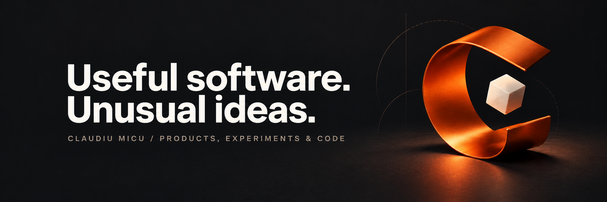

# Hi, I'm Claudiu.

I turn unusual ideas into useful software.

I'm a software engineer in Romania with 11 years of experience. I'm building products of my own and sharing the demos, decisions and lessons along the way.

## Building now

### Wakebound

An alarm app with character companions and wake-up challenges.

I'm exploring how reliable software and playful design can make getting out of bed more engaging.

[Website](https://wakebound.app) · [iPhone](https://apps.apple.com/ro/app/wakebound/id6809554207) · [Android](https://play.google.com/store/apps/details?id=com.wakebound.app)

### Also working on

[Clasary](https://clasary.com/) — a place for class money and decisions.

## Engineering background

- Founding engineering team at Pooky, helping build the backend and blockchain architecture from the ground up.
- Experience across banking systems, content moderation, cloud infrastructure and startup products.
- Hands-on with Go, TypeScript, PostgreSQL, distributed systems, AWS, GCP and Solidity.

## What I share

- Product demos and the decisions behind them.
- Engineering tradeoffs and useful experiments.
- Experiments with finding users and building an independent business.

## Follow the work

[X](https://x.com/_MrCode_) · [LinkedIn](https://www.linkedin.com/in/claudiu~micu/) · [Reddit](https://www.reddit.com/user/codeitfast/)
